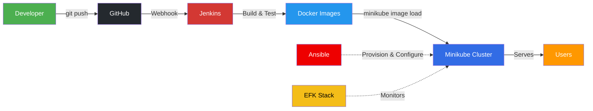
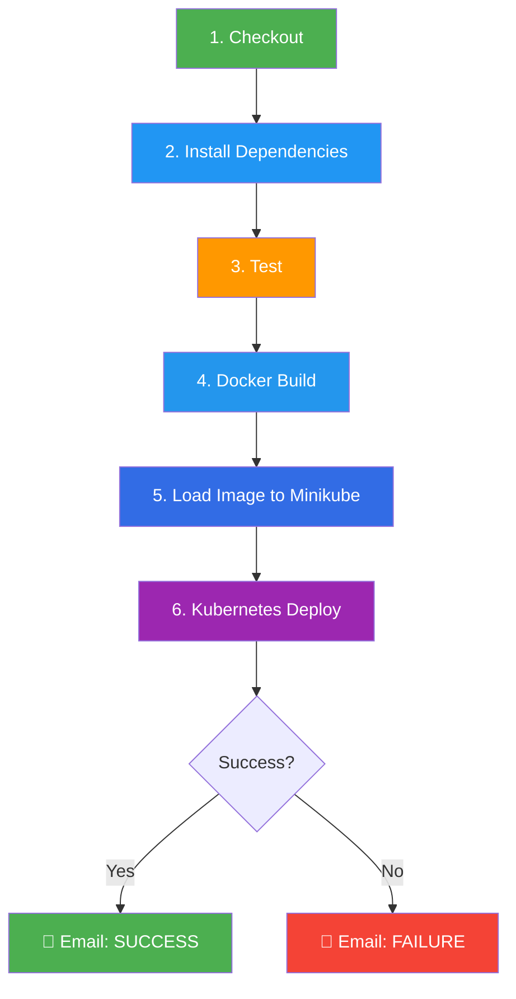
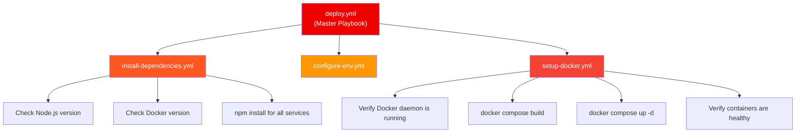
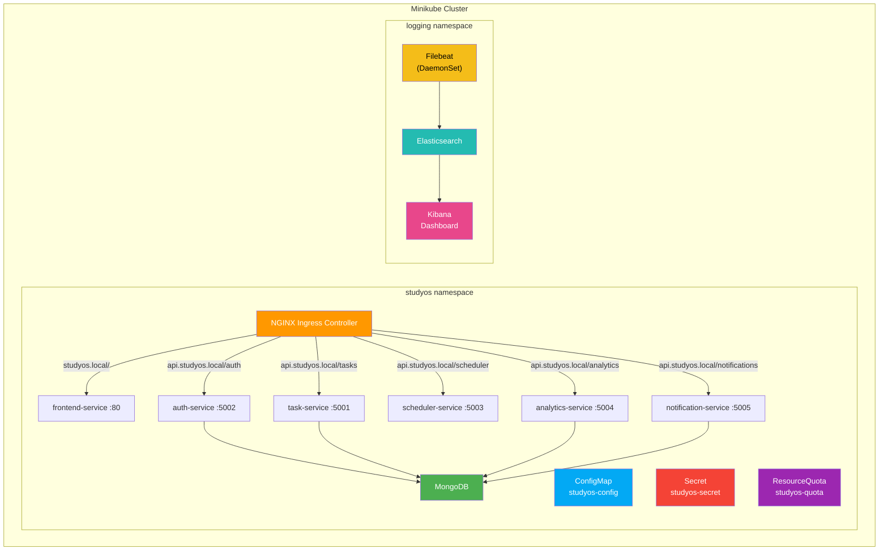

# StudyOS Microservices — DevOps Pipeline Explanation

## 1. Project Overview

**StudyOS** is a student productivity platform built as a **microservices architecture**. The DevOps goal is to automate the entire lifecycle — from a developer's `git push` to a fully deployed, auto-scaling, monitored production cluster.

### Microservices

| Service | Port | Responsibility |
|---|---|---|
| **auth-service** | 5002 | User registration, login, JWT authentication |
| **task-service** | 5001 | CRUD for student tasks/assignments |
| **scheduler-service** | 5003 | Task scheduling and reminders |
| **analytics-service** | 5004 | Data analytics and reporting |
| **notification-service** | 5005 | Email/push notifications |
| **frontend** | 80 | React-based UI |
| **MongoDB** | 27017 | Shared database |

---

## 2. High-Level Architecture



---

## 3. CI/CD Pipeline (Jenkins)

The project uses a **multi-pipeline Jenkins architecture**: one **infrastructure pipeline** and separate pipelines for each microservice.

### 3.1 Infrastructure Pipeline (`Jenkinsfile` — root)

This pipeline runs **first** and sets up the shared Kubernetes foundation:

```
Stage 1: Checkout        → Pull latest code from GitHub
Stage 2: K8s Infra Deploy →
    ├── kubectl apply namespace.yaml        (creates 'studyos' namespace)
    ├── kubectl apply configmap.yaml        (non-sensitive config: ports, URLs)
    ├── kubectl apply secret.yaml           (sensitive config: MongoDB URI, JWT)
    ├── kubectl apply storage/              (PersistentVolume + PVC for MongoDB)
    ├── kubectl apply mongodb/              (MongoDB StatefulSet/Deployment)
    ├── kubectl apply ingress.yaml          (NGINX routing rules)
    └── kubectl apply resource-quota.yaml   (cluster resource limits)
```

### 3.2 Per-Service Pipeline (e.g., `services/analytics-service/Jenkinsfile`)

Each of the 7 services (5 backend + frontend + more) has its **own Jenkinsfile** with identical stages:



#### Stage Breakdown

| Stage | What Happens | Command |
|---|---|---|
| **Checkout** | Pulls latest code from GitHub | `checkout scm` |
| **Install Dependencies** | Installs Node.js packages | `npm install` |
| **Test** | Runs unit tests | `npm test -- --passWithNoTests` |
| **Docker Build** | Builds a Docker image from Dockerfile | `docker build -t <image>:latest .` |
| **Load to Minikube** | Pushes image into local Minikube registry | `minikube image load <image>:latest` |
| **K8s Deploy** | Applies K8s manifests + waits for rollout | `kubectl apply -f k8s/<service>/` |
| **Post-Build** | Sends email notification on success/failure | `emailext(...)` |

> [!IMPORTANT]
> The `minikube image load` approach avoids needing a remote Docker registry (like Docker Hub) — images are loaded directly into Minikube's local image cache.

---

## 4. Containerization (Docker)

Each microservice has a **Dockerfile** following the same pattern:

```dockerfile
FROM node:18-alpine          # Lightweight base image
WORKDIR /app                 # Set working directory
COPY package*.json ./        # Copy dependency manifests first (cache layer)
RUN npm install              # Install dependencies
COPY . .                     # Copy application code
EXPOSE 5004                  # Expose service port
CMD ["npm", "start"]         # Start the service
```

**Docker Compose** (`docker-compose.yml`) is used for **local development** — it spins up all 7 services + MongoDB with a single `docker compose up` command.

---

## 5. Configuration Management (Ansible)

Ansible automates the **initial server provisioning** on Ubuntu:



### Playbooks

| Playbook | Purpose |
|---|---|
| `deploy.yml` | **Master** — orchestrates all other playbooks in order |
| `install-dependencies.yml` | Validates project structure, checks Node/Docker versions, runs `npm install` for every service |
| `configure-env.yml` | Sets up environment variables and configuration files |
| `setup-docker.yml` | Stops old containers, rebuilds images, starts fresh containers, verifies health |

---

## 6. Kubernetes Orchestration

### 6.1 Cluster Layout



### 6.2 Kubernetes Resources per Service

Each microservice is deployed with **3 K8s manifests**:

| Resource | Purpose | Key Details |
|---|---|---|
| **Deployment** | Manages pods | RollingUpdate strategy (`maxSurge: 1, maxUnavailable: 0`), liveness + readiness probes on `/health`, resource limits (128Mi–256Mi RAM, 100m–300m CPU) |
| **Service** | Internal networking | ClusterIP service exposing the pod's port within the cluster |
| **HPA** | Auto-scaling | Scales 2–3 replicas based on CPU (>70%) and memory (>80%) utilization, 5-min scale-down stabilization |

### 6.3 Shared Infrastructure Resources

| Resource | File | Purpose |
|---|---|---|
| **Namespace** | `namespace.yaml` | Isolates all StudyOS resources in `studyos` namespace |
| **ConfigMap** | `configmap.yaml` | Non-sensitive config: service URLs, ports, MongoDB host, `NODE_ENV` |
| **Secret** | `secret.yaml` | Sensitive data: `MONGO_URI`, `JWT_SECRET` (base64 encoded) |
| **Ingress** | `ingress.yaml` | NGINX-based HTTP routing — `studyos.local` for frontend, `api.studyos.local/*` for backend APIs |
| **ResourceQuota** | `resource-quota.yaml` | Cluster limits: 20 pods, 2 CPU / 2Gi RAM requests, 4 CPU / 4Gi RAM limits, 5 PVCs, 10 services |
| **Storage** | `storage/` | PersistentVolume + PVC for MongoDB data persistence |

---

## 7. Centralized Logging (EFK Stack)

The project implements the **EFK (Elasticsearch-Filebeat-Kibana)** stack in a separate `logging` namespace:

| Component | Role | K8s Resource Type |
|---|---|---|
| **Filebeat** | Collects container logs from every node (`/var/log/containers/*.log`) | **DaemonSet** — runs on every node |
| **Elasticsearch** | Indexes and stores log data | Deployment + PVC for persistence |
| **Kibana** | Web dashboard for log visualization and search | Deployment + Service |

> [!NOTE]
> Filebeat uses `add_kubernetes_metadata` processor to automatically enrich logs with pod name, namespace, and labels — making it easy to filter logs per microservice in Kibana.

---

## 8. End-to-End Pipeline Flow

Here's what happens when a developer pushes code:

```
1. Developer pushes to GitHub (feature/final-submission branch)
           │
           ▼
2. GitHub Webhook triggers Jenkins
           │
           ▼
3. Infrastructure Pipeline (runs first if needed)
   └── Sets up namespace, configmap, secret, MongoDB, ingress, quotas
           │
           ▼
4. Per-Service Pipeline (runs for changed service)
   ├── Checkout code
   ├── npm install
   ├── npm test
   ├── docker build → creates container image
   ├── minikube image load → pushes to local cluster
   ├── kubectl apply → deploys to K8s
   └── kubectl rollout status → waits for healthy rollout
           │
           ▼
5. K8s takes over
   ├── RollingUpdate ensures zero downtime
   ├── Liveness/Readiness probes verify health
   ├── HPA scales pods based on CPU/memory load
   └── Ingress routes external traffic to correct service
           │
           ▼
6. EFK Stack monitors everything
   ├── Filebeat collects logs from all pods
   ├── Elasticsearch indexes them
   └── Kibana provides searchable dashboard
           │
           ▼
7. Email notification sent (success/failure)
```

---

## 9. DevOps Tools Summary

| Category | Tool | Purpose |
|---|---|---|
| **Source Control** | Git + GitHub | Version control and collaboration |
| **CI/CD** | Jenkins (Declarative Pipelines) | Automated build, test, deploy |
| **Containerization** | Docker | Package each service as a container |
| **Container Orchestration** | Kubernetes (Minikube) | Manage, scale, and heal containers |
| **Configuration Mgmt** | Ansible | Automate server provisioning |
| **Logging** | EFK (Elasticsearch + Filebeat + Kibana) | Centralized log collection and monitoring |
| **Notifications** | Jenkins Email Extension | Build status alerts |
| **Reverse Proxy** | NGINX Ingress Controller | HTTP routing and load balancing |

---

## 10. Key DevOps Practices Demonstrated

| Practice | Implementation |
|---|---|
| **Microservices Architecture** | 5 independent backend services + frontend |
| **Infrastructure as Code (IaC)** | All K8s manifests and Ansible playbooks are version-controlled |
| **CI/CD Automation** | Jenkins pipelines auto-trigger on code push |
| **Containerization** | Every service has a Dockerfile |
| **Container Orchestration** | K8s Deployments, Services, HPA |
| **Zero-Downtime Deployments** | RollingUpdate strategy with readiness probes |
| **Auto-Scaling** | HorizontalPodAutoscaler based on CPU/memory |
| **Centralized Logging** | EFK stack in separate namespace |
| **Configuration Management** | ConfigMaps (non-sensitive) + Secrets (sensitive) |
| **Resource Governance** | ResourceQuota prevents namespace overuse |
| **Health Monitoring** | Liveness + Readiness probes on `/health` endpoint |
| **Email Notifications** | Jenkins emailext on build success/failure |
